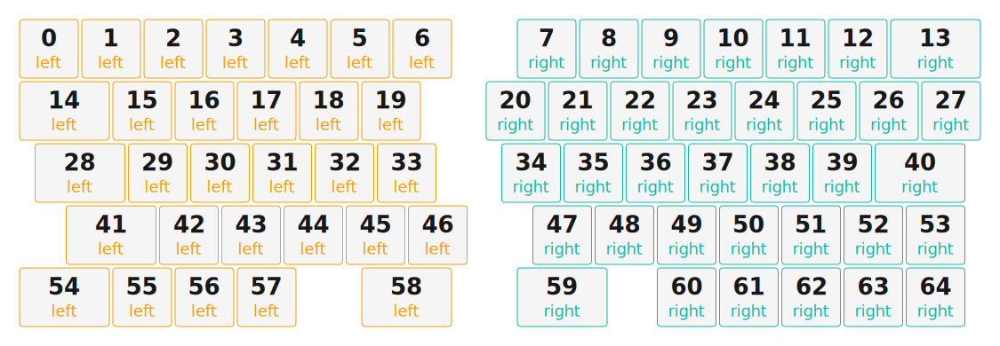

# ZMK Configuration for bandaits

*Generated by Shield Wizard for ZMK*


KLE NG plate genarator



Download compiled firmware from the Actions tab. <https://zmk.dev/docs/user-setup#installing-the-firmware>

Edit your keymap <https://zmk.dev/docs/keymaps>.
User keymap is located at [`config/bandaits.keymap`](config/bandaits.keymap).

-----

<details>
<summary>
Shield Wizard Debug Information
</summary>

In case of broken configuration, here is the Shield Wizard internal data used to generate this configuration:

Commit: 0364074123b384abd5563bc6cdf4473384edaabb

```json
{"name":"bandaits","shield":"bandaits","dongle":false,"modules":[],"layout":[{"id":"01KW8DC0YJK5VRYNE1DJTQJSMC","part":0,"row":0,"col":0,"w":1,"h":1,"x":0,"y":0,"r":0,"rx":0,"ry":0},{"id":"01KW8DC1QXHE81JEB8AXVQ2RBZ","part":0,"row":0,"col":1,"w":1,"h":1,"x":1,"y":0,"r":0,"rx":0,"ry":0},{"id":"01KW8DC1YKR1AGKN7D2DKH54W7","part":0,"row":0,"col":2,"w":1,"h":1,"x":2,"y":0,"r":0,"rx":0,"ry":0},{"id":"01KW8DC255GRD85BD9RYQWGG2Z","part":0,"row":0,"col":3,"w":1,"h":1,"x":3,"y":0,"r":0,"rx":0,"ry":0},{"id":"01KW8DC2C6KK0F9FSRYW0P9Z33","part":0,"row":0,"col":4,"w":1,"h":1,"x":4,"y":0,"r":0,"rx":0,"ry":0},{"id":"01KW8DC2JP3D267SXWTF6ZX8VH","part":0,"row":0,"col":5,"w":1,"h":1,"x":5,"y":0,"r":0,"rx":0,"ry":0},{"id":"01KW8DC32Q3YEEAJSB6A0B7BES","part":0,"row":0,"col":6,"w":1,"h":1,"x":6,"y":0,"r":0,"rx":0,"ry":0},{"id":"01KW8DNZF5BACG8PJFVXPAKBAZ","part":1,"row":0,"col":9,"w":1,"h":1,"x":8,"y":0,"r":0,"rx":0,"ry":0},{"id":"01KW8DNZR6JNH9BPGMW7PZF0HN","part":1,"row":0,"col":10,"w":1,"h":1,"x":9,"y":0,"r":0,"rx":0,"ry":0},{"id":"01KW8DNZXS6GM20YB4J3NM5KN7","part":1,"row":0,"col":11,"w":1,"h":1,"x":10,"y":0,"r":0,"rx":0,"ry":0},{"id":"01KW8DP04RS6D0TS2RTN8YJP2E","part":1,"row":0,"col":12,"w":1,"h":1,"x":11,"y":0,"r":0,"rx":0,"ry":0},{"id":"01KW8DP0P1V4DXTDAYS97WG24E","part":1,"row":0,"col":13,"w":1,"h":1,"x":12,"y":0,"r":0,"rx":0,"ry":0},{"id":"01KW8DP0Z17F1MVH3XADS3EM04","part":1,"row":0,"col":14,"w":1,"h":1,"x":13,"y":0,"r":0,"rx":0,"ry":0},{"id":"01KW8DP1D1ZSSPGGRV7X5S1VF7","part":1,"row":0,"col":15,"w":1.5,"h":1,"x":14,"y":0,"r":0,"rx":0,"ry":0},{"id":"01KW8DC3NVCHKFJMCMJD868A2A","part":0,"row":1,"col":0,"w":1.5,"h":1,"x":0,"y":1,"r":0,"rx":0,"ry":0},{"id":"01KW8DC5E5WJZAQ164TZAJ0XX9","part":0,"row":1,"col":1,"w":1,"h":1,"x":1.5,"y":1,"r":0,"rx":0,"ry":0},{"id":"01KW8DC5K8ZWZKRXFXX3EAEJSP","part":0,"row":1,"col":2,"w":1,"h":1,"x":2.5,"y":1,"r":0,"rx":0,"ry":0},{"id":"01KW8DC5QZB3TKHEHGBX3WQ861","part":0,"row":1,"col":3,"w":1,"h":1,"x":3.5,"y":1,"r":0,"rx":0,"ry":0},{"id":"01KW8DC5X89NZ5SE4KKZWS5DW9","part":0,"row":1,"col":4,"w":1,"h":1,"x":4.5,"y":1,"r":0,"rx":0,"ry":0},{"id":"01KW8DC621PXQ4SXVQC3D6HAEG","part":0,"row":1,"col":5,"w":1,"h":1,"x":5.5,"y":1,"r":0,"rx":0,"ry":0},{"id":"01KW8DPXGN5TZ503HKZ4WEBHT2","part":1,"row":1,"col":9,"w":1,"h":1,"x":7.5,"y":1,"r":0,"rx":0,"ry":0},{"id":"01KW8DPXN6HGMGXHANKTJAT924","part":1,"row":1,"col":10,"w":1,"h":1,"x":8.5,"y":1,"r":0,"rx":0,"ry":0},{"id":"01KW8DPXP5WJK7NFW44E461NA6","part":1,"row":1,"col":11,"w":1,"h":1,"x":9.5,"y":1,"r":0,"rx":0,"ry":0},{"id":"01KW8DPXTG55X94S7FY7D1ZHS4","part":1,"row":1,"col":12,"w":1,"h":1,"x":10.5,"y":1,"r":0,"rx":0,"ry":0},{"id":"01KW8DPXVGP54N8EXB23EY6FV2","part":1,"row":1,"col":13,"w":1,"h":1,"x":11.5,"y":1,"r":0,"rx":0,"ry":0},{"id":"01KW8DPY08KW5KCVW5D8A3AFDW","part":1,"row":1,"col":14,"w":1,"h":1,"x":12.5,"y":1,"r":0,"rx":0,"ry":0},{"id":"01KW8DPY181XXDWXK8MN7C3PQG","part":1,"row":1,"col":15,"w":1,"h":1,"x":13.5,"y":1,"r":0,"rx":0,"ry":0},{"id":"01KW8DQ31YYSK5B25F8TTTBP03","part":1,"row":1,"col":16,"w":1,"h":1,"x":14.5,"y":1,"r":0,"rx":0,"ry":0},{"id":"01KW8DC670C1NY9930H32NCV4K","part":0,"row":2,"col":0,"w":1.5,"h":1,"x":0.25,"y":2,"r":0,"rx":0,"ry":0},{"id":"01KW8DC6CMF23HPFWZH60GP2AG","part":0,"row":2,"col":1,"w":1,"h":1,"x":1.75,"y":2,"r":0,"rx":0,"ry":0},{"id":"01KW8DC6GP7TNSAJ6CR5W2N4MZ","part":0,"row":2,"col":2,"w":1,"h":1,"x":2.75,"y":2,"r":0,"rx":0,"ry":0},{"id":"01KW8DC6NC36AQ5YVFYJW8TGH4","part":0,"row":2,"col":3,"w":1,"h":1,"x":3.75,"y":2,"r":0,"rx":0,"ry":0},{"id":"01KW8DC6T096AFWXWAKZ7D2Z26","part":0,"row":2,"col":4,"w":1,"h":1,"x":4.75,"y":2,"r":0,"rx":0,"ry":0},{"id":"01KW8DC6YS68QQQM2EJ8B1XPMQ","part":0,"row":2,"col":5,"w":1,"h":1,"x":5.75,"y":2,"r":0,"rx":0,"ry":0},{"id":"01KW8DQMVP7Y1KCDC38BY8JFN5","part":1,"row":2,"col":9,"w":1,"h":1,"x":7.75,"y":2,"r":0,"rx":0,"ry":0},{"id":"01KW8DQN0AG2DA2FPAZEN7HZJM","part":1,"row":2,"col":10,"w":1,"h":1,"x":8.75,"y":2,"r":0,"rx":0,"ry":0},{"id":"01KW8DQN1P6EYQG5T236ECB3BR","part":1,"row":2,"col":11,"w":1,"h":1,"x":9.75,"y":2,"r":0,"rx":0,"ry":0},{"id":"01KW8DQN599A70FNEJZMAMXTDS","part":1,"row":2,"col":12,"w":1,"h":1,"x":10.75,"y":2,"r":0,"rx":0,"ry":0},{"id":"01KW8DQN6HK029G0V9V092JMHW","part":1,"row":2,"col":13,"w":1,"h":1,"x":11.75,"y":2,"r":0,"rx":0,"ry":0},{"id":"01KW8DQNABB5JSE0Y4CGNHW2NF","part":1,"row":2,"col":14,"w":1,"h":1,"x":12.75,"y":2,"r":0,"rx":0,"ry":0},{"id":"01KW8DQR6ZZQ17AG2TRGR6XQ5W","part":1,"row":2,"col":15,"w":1.5,"h":1,"x":13.75,"y":2,"r":0,"rx":0,"ry":0},{"id":"01KW8DC73KMTCP43X3W7954951","part":0,"row":3,"col":0,"w":1.5,"h":1,"x":0.75,"y":3,"r":0,"rx":0,"ry":0},{"id":"01KW8DC7KX44FFW57VJ4SW15ZQ","part":0,"row":3,"col":2,"w":1,"h":1,"x":2.25,"y":3,"r":0,"rx":0,"ry":0},{"id":"01KW8DC7NPS6PRPJXKWNC1RHN2","part":0,"row":3,"col":3,"w":1,"h":1,"x":3.25,"y":3,"r":0,"rx":0,"ry":0},{"id":"01KW8DC7TB7ABVQVQZJHG9YE9C","part":0,"row":3,"col":4,"w":1,"h":1,"x":4.25,"y":3,"r":0,"rx":0,"ry":0},{"id":"01KW8DC7Z65XVW3FV4J8YMVS1A","part":0,"row":3,"col":5,"w":1,"h":1,"x":5.25,"y":3,"r":0,"rx":0,"ry":0},{"id":"01KW8DC7ZYD4N0VDM4Z2CSHFYH","part":0,"row":3,"col":6,"w":1,"h":1,"x":6.25,"y":3,"r":0,"rx":0,"ry":0},{"id":"01KW8DRPPMH95JD88VDNBH1775","part":1,"row":3,"col":9,"w":1,"h":1,"x":8.25,"y":3,"r":0,"rx":0,"ry":0},{"id":"01KW8DRPTSCZJV6J3JK5PM1JWG","part":1,"row":3,"col":10,"w":1,"h":1,"x":9.25,"y":3,"r":0,"rx":0,"ry":0},{"id":"01KW8DRPW7PDW39213VWM4FSW8","part":1,"row":3,"col":11,"w":1,"h":1,"x":10.25,"y":3,"r":0,"rx":0,"ry":0},{"id":"01KW8DRPZR68YFHK6RC166BV81","part":1,"row":3,"col":12,"w":1,"h":1,"x":11.25,"y":3,"r":0,"rx":0,"ry":0},{"id":"01KW8DRQ51KKEMXSNQ16T0ZG2G","part":1,"row":3,"col":13,"w":1,"h":1,"x":12.25,"y":3,"r":0,"rx":0,"ry":0},{"id":"01KW8DRR0FV01EFBKVR91EQH86","part":1,"row":3,"col":14,"w":1,"h":1,"x":13.25,"y":3,"r":0,"rx":0,"ry":0},{"id":"01KW8DRRXVXCNVEVEG29HH3WHH","part":1,"row":3,"col":15,"w":1,"h":1,"x":14.25,"y":3,"r":0,"rx":0,"ry":0},{"id":"01KW8DC84H902B620RS40CPD0Y","part":0,"row":4,"col":0,"w":1.5,"h":1,"x":0,"y":4,"r":0,"rx":0,"ry":0},{"id":"01KW8DC85CS8W2TZYPNDX4HEP8","part":0,"row":4,"col":1,"w":1,"h":1,"x":1.5,"y":4,"r":0,"rx":0,"ry":0},{"id":"01KW8DC89VMYBZREF9P51MF184","part":0,"row":4,"col":2,"w":1,"h":1,"x":2.5,"y":4,"r":0,"rx":0,"ry":0},{"id":"01KW8DC8APQ5PG6N89NS81GY1N","part":0,"row":4,"col":3,"w":1,"h":1,"x":3.5,"y":4,"r":0,"rx":0,"ry":0},{"id":"01KW8DC8FCN6SHK3J7WSW3052P","part":0,"row":4,"col":5,"w":1.5,"h":1,"x":5.5,"y":4,"r":0,"rx":0,"ry":0},{"id":"01KW8DS7CY7CRFMCMFBJSYKBF5","part":1,"row":4,"col":9,"w":1.5,"h":1,"x":8,"y":4,"r":0,"rx":0,"ry":0},{"id":"01KW8DS7Y3QAZ66FJF098WGA1J","part":1,"row":4,"col":12,"w":1,"h":1,"x":10.25,"y":4,"r":0,"rx":0,"ry":0},{"id":"01KW8DS8N7JYBV75DTBQ7KC4M8","part":1,"row":4,"col":13,"w":1,"h":1,"x":11.25,"y":4,"r":0,"rx":0,"ry":0},{"id":"01KW8DS93BPCZ0D4V8G74XEG4P","part":1,"row":4,"col":14,"w":1,"h":1,"x":12.25,"y":4,"r":0,"rx":0,"ry":0},{"id":"01KW8DS9CRJBM1B118PFFEPE2N","part":1,"row":4,"col":15,"w":1,"h":1,"x":13.25,"y":4,"r":0,"rx":0,"ry":0},{"id":"01KW8DS9MB3SQ3KW5WFSR28SQ3","part":1,"row":4,"col":16,"w":1,"h":1,"x":14.25,"y":4,"r":0,"rx":0,"ry":0}],"parts":[{"name":"left","controller":"nice_nano_v2","wiring":"matrix_diode","keys":{"01KW8DC0YJK5VRYNE1DJTQJSMC":{"output":"d2","input":"d3"},"01KW8DC3NVCHKFJMCMJD868A2A":{"output":"d2","input":"d15"},"01KW8DC670C1NY9930H32NCV4K":{"output":"d2","input":"d18"},"01KW8DC73KMTCP43X3W7954951":{"output":"d2","input":"d19"},"01KW8DC84H902B620RS40CPD0Y":{"output":"d2","input":"d20"},"01KW8DC1QXHE81JEB8AXVQ2RBZ":{"output":"d4","input":"d3"},"01KW8DC5E5WJZAQ164TZAJ0XX9":{"output":"d4","input":"d15"},"01KW8DC6CMF23HPFWZH60GP2AG":{"output":"d4","input":"d18"},"01KW8DC85CS8W2TZYPNDX4HEP8":{"output":"d4","input":"d20"},"01KW8DC1YKR1AGKN7D2DKH54W7":{"output":"d5","input":"d3"},"01KW8DC5K8ZWZKRXFXX3EAEJSP":{"output":"d5","input":"d15"},"01KW8DC6GP7TNSAJ6CR5W2N4MZ":{"output":"d5","input":"d18"},"01KW8DC7KX44FFW57VJ4SW15ZQ":{"output":"d5","input":"d19"},"01KW8DC89VMYBZREF9P51MF184":{"output":"d5","input":"d20"},"01KW8DC255GRD85BD9RYQWGG2Z":{"output":"d6","input":"d3"},"01KW8DC5QZB3TKHEHGBX3WQ861":{"output":"d6","input":"d15"},"01KW8DC6NC36AQ5YVFYJW8TGH4":{"output":"d6","input":"d18"},"01KW8DC7NPS6PRPJXKWNC1RHN2":{"output":"d6","input":"d19"},"01KW8DC8APQ5PG6N89NS81GY1N":{"output":"d6","input":"d20"},"01KW8DC2C6KK0F9FSRYW0P9Z33":{"output":"d7","input":"d3"},"01KW8DC5X89NZ5SE4KKZWS5DW9":{"output":"d7","input":"d15"},"01KW8DC6T096AFWXWAKZ7D2Z26":{"output":"d7","input":"d18"},"01KW8DC7TB7ABVQVQZJHG9YE9C":{"output":"d7","input":"d19"},"01KW8DC2JP3D267SXWTF6ZX8VH":{"output":"d8","input":"d3"},"01KW8DC621PXQ4SXVQC3D6HAEG":{"output":"d8","input":"d15"},"01KW8DC6YS68QQQM2EJ8B1XPMQ":{"output":"d8","input":"d18"},"01KW8DC7Z65XVW3FV4J8YMVS1A":{"output":"d8","input":"d19"},"01KW8DC8FCN6SHK3J7WSW3052P":{"output":"d8","input":"d20"},"01KW8DC32Q3YEEAJSB6A0B7BES":{"output":"d9","input":"d3"},"01KW8DC7ZYD4N0VDM4Z2CSHFYH":{"output":"d9","input":"d19"}},"encoders":[],"pins":{"d2":"output","d4":"output","d5":"output","d6":"output","d7":"output","d8":"output","d9":"output","d3":"input","d15":"input","d18":"input","d19":"input","d20":"input"},"buses":[{"type":"spi","name":"spi0","devices":[]},{"type":"spi","name":"spi1","devices":[]},{"type":"spi","name":"spi2","devices":[]},{"type":"spi","name":"spi3","devices":[]},{"type":"i2c","name":"i2c0","devices":[]},{"type":"i2c","name":"i2c1","devices":[]}]},{"name":"right","controller":"nice_nano_v2","wiring":"matrix_diode","keys":{"01KW8DNZF5BACG8PJFVXPAKBAZ":{"input":"d20","output":"d9"},"01KW8DQMVP7Y1KCDC38BY8JFN5":{"input":"d7","output":"d9"},"01KW8DRPPMH95JD88VDNBH1775":{"input":"d6","output":"d9"},"01KW8DS7CY7CRFMCMFBJSYKBF5":{"input":"d5","output":"d9"},"01KW8DNZR6JNH9BPGMW7PZF0HN":{"input":"d20","output":"d14"},"01KW8DPXN6HGMGXHANKTJAT924":{"input":"d8","output":"d14"},"01KW8DQN0AG2DA2FPAZEN7HZJM":{"input":"d7","output":"d14"},"01KW8DRPTSCZJV6J3JK5PM1JWG":{"input":"d6","output":"d14"},"01KW8DNZXS6GM20YB4J3NM5KN7":{"input":"d20","output":"d16"},"01KW8DPXP5WJK7NFW44E461NA6":{"input":"d8","output":"d16"},"01KW8DQN1P6EYQG5T236ECB3BR":{"input":"d7","output":"d16"},"01KW8DRPW7PDW39213VWM4FSW8":{"input":"d6","output":"d16"},"01KW8DP04RS6D0TS2RTN8YJP2E":{"input":"d20","output":"d10"},"01KW8DPXTG55X94S7FY7D1ZHS4":{"input":"d8","output":"d10"},"01KW8DQN599A70FNEJZMAMXTDS":{"input":"d7","output":"d10"},"01KW8DRPZR68YFHK6RC166BV81":{"input":"d6","output":"d10"},"01KW8DS7Y3QAZ66FJF098WGA1J":{"input":"d5","output":"d10"},"01KW8DP0P1V4DXTDAYS97WG24E":{"input":"d20","output":"d15"},"01KW8DPXVGP54N8EXB23EY6FV2":{"input":"d8","output":"d15"},"01KW8DQN6HK029G0V9V092JMHW":{"input":"d7","output":"d15"},"01KW8DRQ51KKEMXSNQ16T0ZG2G":{"input":"d6","output":"d15"},"01KW8DS8N7JYBV75DTBQ7KC4M8":{"input":"d5","output":"d15"},"01KW8DP0Z17F1MVH3XADS3EM04":{"input":"d20","output":"d18"},"01KW8DPY08KW5KCVW5D8A3AFDW":{"input":"d8","output":"d18"},"01KW8DQNABB5JSE0Y4CGNHW2NF":{"input":"d7","output":"d18"},"01KW8DRR0FV01EFBKVR91EQH86":{"input":"d6","output":"d18"},"01KW8DS93BPCZ0D4V8G74XEG4P":{"input":"d5","output":"d18"},"01KW8DP1D1ZSSPGGRV7X5S1VF7":{"input":"d20","output":"d19"},"01KW8DPY181XXDWXK8MN7C3PQG":{"input":"d8","output":"d19"},"01KW8DQR6ZZQ17AG2TRGR6XQ5W":{"input":"d7","output":"d19"},"01KW8DRRXVXCNVEVEG29HH3WHH":{"input":"d6","output":"d19"},"01KW8DS9CRJBM1B118PFFEPE2N":{"input":"d5","output":"d19"},"01KW8DQ31YYSK5B25F8TTTBP03":{"output":"d21","input":"d8"},"01KW8DS9MB3SQ3KW5WFSR28SQ3":{"output":"d21","input":"d5"},"01KW8DPXGN5TZ503HKZ4WEBHT2":{"input":"d8","output":"d9"}},"encoders":[],"pins":{"d21":"output","d20":"input","d8":"input","d7":"input","d6":"input","d5":"input","d9":"output","d14":"output","d16":"output","d10":"output","d15":"output","d18":"output","d19":"output"},"buses":[{"type":"spi","name":"spi0","devices":[]},{"type":"spi","name":"spi1","devices":[]},{"type":"spi","name":"spi2","devices":[]},{"type":"spi","name":"spi3","devices":[]},{"type":"i2c","name":"i2c0","devices":[]},{"type":"i2c","name":"i2c1","devices":[]}]}]}
```

</details>
